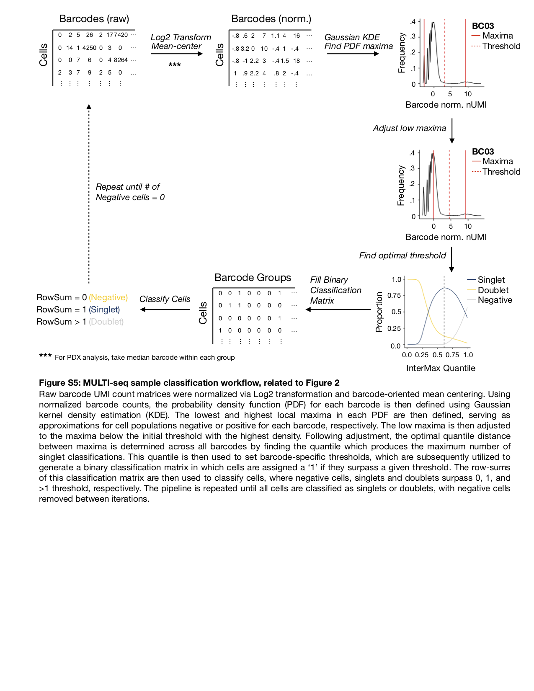

# MULTI-seq Sample Classification
MULTI-seq is a method for single-cell RNA sequencing sample multiplexing (for more information, check out our preprint: https://www.biorxiv.org/content/early/2018/08/08/387241)

Here, we provide source code for our sample classification framework. More in-depth documentation / implementation with Seurat to follow...  

